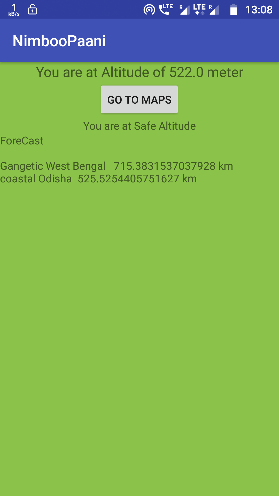
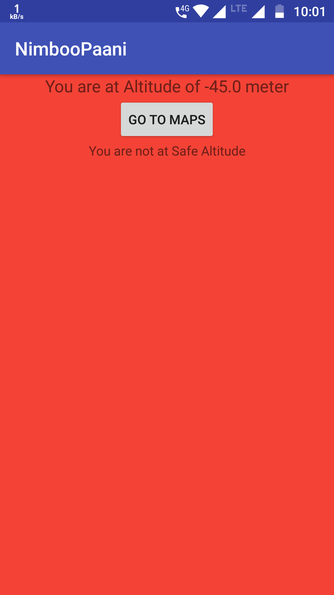
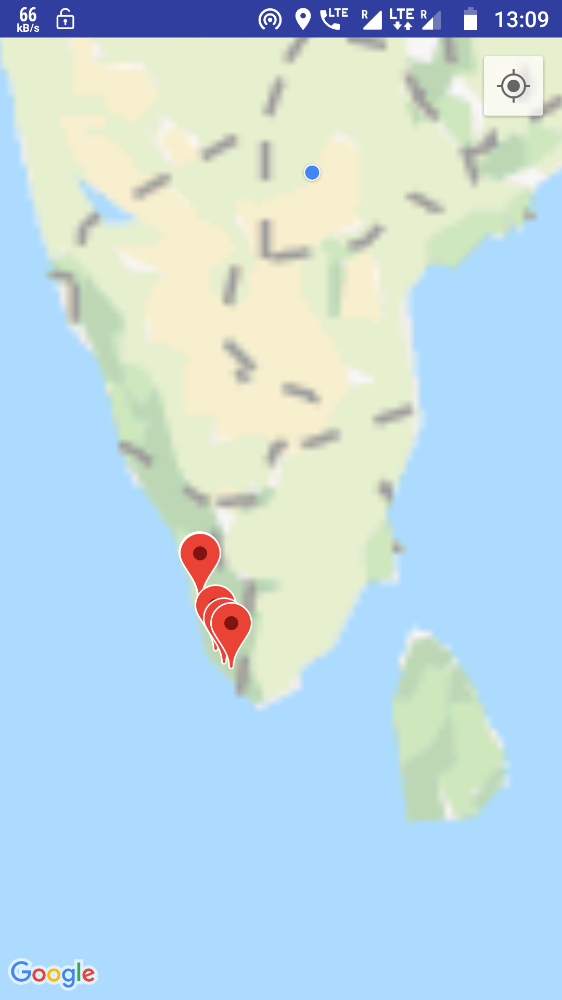
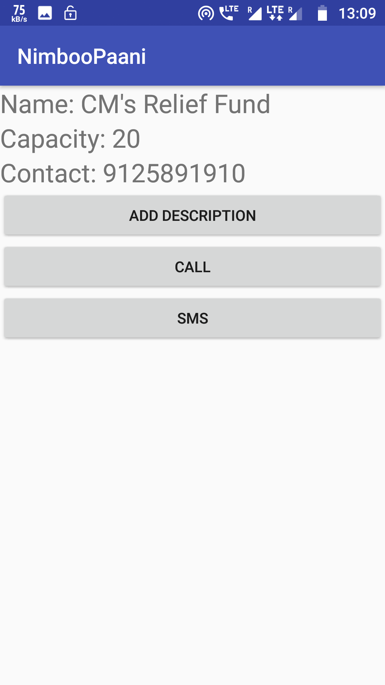
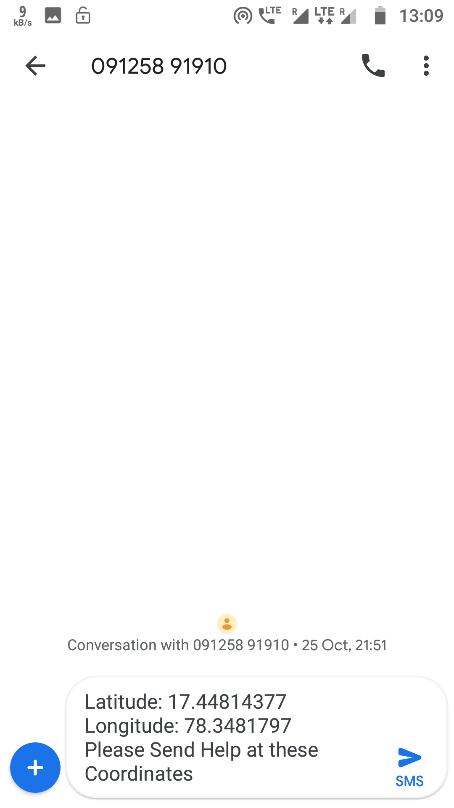

# NimbooPaani
This Application is made as a submission for Microsoft CodeFunDo++ 2018.

This is a Flood Management application. It is helpful before, during and after the flood. The Android Application is mainly useful during the flood.

# Home Page

The home page displays your current altitude from sea level. If you are above some pre defined the safe altitude the home screen will have a green background otherwise it will be red indicating you must migrate to some safe altitude. Further more the home page contains information about the regions where a heavy rain is forecasted in the coming week and their distance from current location

 

 

# Maps Page

When the user Clicks on the maps button on the home page . He is redirected to MAPS page. Where the user can see nearby rescue camps. Clicking on any of the rescue Camp marker would redirect the user to information about that camp.

 

# Camp Page

On the camp page user can see details about the selected camp including capacity and contact. User can directly call or send SMS to given contact number along with user's current co ordinates

 

 

Here is the link to the entire project including the Web Application and Web Server (in dJango)
<a href="https://github.com/manangoel99/NimbooPaani"> Whole Project </a>
